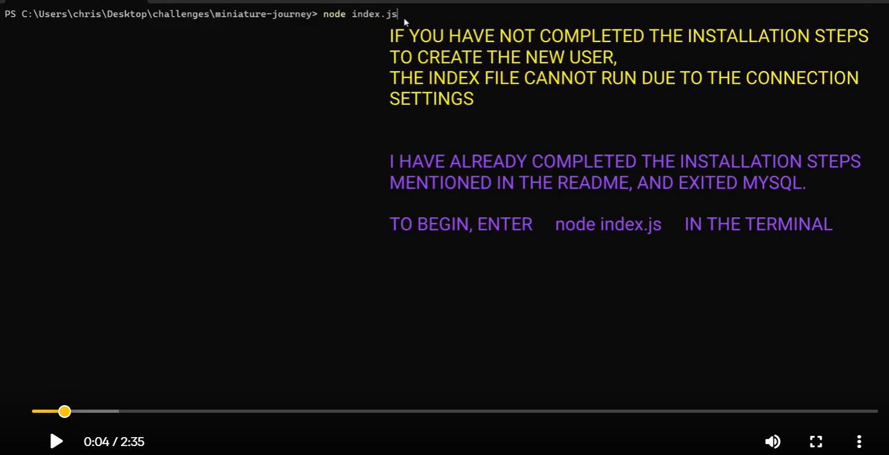

# miniature-journey
Repository for module 12 challenge assignment - SQL Challenge: Employee Tracker

## Description
### Introduction
In the dynamic landscape of software development, creating interfaces that empower non-developers to seamlessly interact with and comprehend database information is essential. These interfaces, often referred to as Content Management Systems (CMS), bridge the gap between raw data and user-friendly accessibility.  

### Objective
The primary aim of this project is to construct a robust command-line application for efficiently managing a company's employee database. Leveraging the power of Node.js, Inquirer, and MySQL, this application provides a user-friendly interface for developers and business owners alike to effortlessly navigate, view, and manipulate crucial information within the database.

## Table of Contents
- [User Story](#user-story)
- [Acceptance Criteria](#acceptance-criteria)
- [Installation](#installation)
- [Usage](#usage)
- [Features](#features)
- [Contributing](#contributing)
- [License](#license)
- [Walkthrough Video](#walkthrough-video)

## User Story
AS A business owner  
I WANT to be able to view and manage the departments, roles, and employees in my company  
SO THAT I can organize and plan my business


## Acceptance Criteria  
GIVEN a command-line application that accepts user input  
WHEN I start the application  
THEN I am presented with the following options: view all departments, view all roles, view all employees, add a department, add a role, add an employee, and update an employee role  
WHEN I choose to view all departments  
THEN I am presented with a formatted table showing department names and department ids  
WHEN I choose to view all roles  
THEN I am presented with the job title, role id, the department that role belongs to, and the salary for that role  
WHEN I choose to view all employees  
THEN I am presented with a formatted table showing employee data, including employee ids, first names, last names, job titles, departments, salaries, and managers that the employees report to  
WHEN I choose to add a department  
THEN I am prompted to enter the name of the department and that department is added to the database  
WHEN I choose to add a role  
THEN I am prompted to enter the name, salary, and department for the role and that role is added to the database  
WHEN I choose to add an employee  
THEN I am prompted to enter the employee’s first name, last name, role, and manager, and that employee is added to the database  
WHEN I choose to update an employee role  
THEN I am prompted to select an employee to update and their new role and this information is updated in the database

## Database Table Relationships  
  

## Installation
Must have a mysql account to use database  
To install the miniature-journey, follow these steps:

1. Clone the repository to your local machine:
   ```bash
   git clone https://github.com/C-Johnson83/miniature-journey.git
2. Change to the project directory:
    ```bash  
    cd miniature-journey  
3. Install the required dependencies using npm:  
    ```bash
    npm i  
4. Launch mysql:  
    ```bash
    mysql -u root -p  
5. When prompted, enter your password  
6. Create a user and password to match the code  
    ```bash
    CREATE USER 'kitchenSink'@'localhost' IDENTIFIED BY 'superSecretMagicPassword'; 
7. Give the user the same privileges as the root user  
    ```bash
    GRANT ALL PRIVILEGES ON * . * TO 'kitchenSink'@'localhost';
8. To make the changes effective immediately  
    ```bash
    FLUSH PRIVILEGES;  
9. To create the database  
    ```bash
    source db/schema.sql;  
10. To preload the database  
    ```bash
    source db/seeds.sql;  
11. Switch to the database to check the data if needed
    ```bash
    USE company_roster_db;  
12. Check the employee table to confirm the seed data populated  
    ```bash
    SELECT * FROM employee;  
13. Exit mysql after confirming the seed data  
    ```bash
    exit;  
## Usage  
To use the miniature-journey, run the following command in your terminal to start the app:  
  
      node index.js  
Follow the prompts in the command-line interface to view and manage the fictitious company data.

- View all departments, roles, and employees.
- Add new departments, roles, and employees.
- Update an employee's role as needed.  

This interactive command-line application allows you to easily manage your company's employee database using Node.js, Inquirer, and MySQL. 

## Features  
View All Departments, Roles, and Employees:
- Users can view a formatted table displaying department names and IDs.  
- Users can view job titles, role IDs, departments, and salaries for all roles.  
- Users can view employee data, including IDs, first names, last names, job titles, departments, salaries, and manager information.  

Add Department, Role, and Employee:  
- Users can add a new department by entering the department name.  
- Users can add a new role by entering the role name, salary, and selecting the department.  
- Users can add a new employee by providing their first name, last name, role, and manager information.  
- Users can update an employee's role by selecting the employee and specifying the new role.

### Future Development/Bonus
Try to add some additional functionality, such as the ability to do the following:

- Update employee managers.
- View employees by manager.
- View employees by department.
- Delete departments, roles, and employees.
- View the total utilized budget of a department—in other words, the combined salaries of all employees in that department.


## Contributing
If you'd like to contribute to this project, please follow these guidelines:  
Fork the repository.
Create a new branch for your feature or fix: 

    
    git checkout -b feature-name
Make your changes and commit them:  


    git commit -m 'Add new feature'  

Push to your created branch:  

    git push origin feature-name.  
Create a pull request with a detailed description of your changes.  

## License
This project is licensed under the MIT license.  
License Link  
https://opensource.org/licenses/MIT   
[]  

## Walkthrough Video
You can watch a walkthrough video demonstrating how to use the application and showcasing it's functionality by clicking the link below. 

### Demo

https://watch.screencastify.com/v/hCjjemZXyragrzTFCEDD


